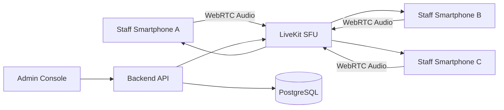

# 02 System Architecture

## 全体構成

```text
スマホ / PCブラウザ
  ↓ WebRTC
LiveKit Server
  ↓ WebRTC
各スタッフ端末
```

## 推奨アーキテクチャ

### MVP

- Client: Next.js Web App
- Voice: livekit-client
- Token API: Next.js API Route
- SFU: LiveKit self-hosted Docker
- Network: 院内Wi-Fi

### 本番版

- Client: React Native iOS/Android App
- Backend: Node.js / NestJS / FastAPI
- SFU: LiveKit self-hosted or LiveKit Cloud
- DB: PostgreSQL
- Cache/Session: Redis
- Monitoring: Grafana / Prometheus / Sentry
- Distribution: MDMまたは院内専用配布

## なぜSFUか

多人数音声通話では、各端末が全員に直接音声を送るP2P方式より、SFUが中継する構成が安定しやすいです。
端末側の負荷とネットワーク負荷を抑えやすく、ルーム管理や拡張も容易になります。

## 音声コーデック

- Opusを前提
- エコーキャンセル
- ノイズ抑制
- 自動ゲイン制御

ブラウザやOSのWebRTC実装がこれらを扱います。
本番版では、端末ごとの音質差をテストで確認します。

## ルーム設計

### 初期ルーム

- front
- clinic
- surgery
- sterilization
- all

### 本番ルーム命名

```text
{clinic_id}:{room_type}
```

例:

```text
oiso:front
oiso:clinic
aoyama:all
```

## 緊急呼び出し設計

MVPでは、緊急ボタンで全体ルームに切り替えます。

本番版では以下のどちらかにします。

### 案A: 全端末が常にallルームにも接続

- メリット: 緊急呼び出しが確実
- デメリット: 実装と端末負荷が増える

### 案B: サーバー側通知で強制的にallルームへ参加

- メリット: 管理しやすい
- デメリット: 通知遅延やOS制約がある

推奨は案Aです。
医療現場では緊急性の高い呼び出しがあるため、全体待受は優先度が高いです。

## PTT設計

MVPでは画面上のボタンを押している間だけマイクを有効化します。

本番版では以下を検討します。

- Bluetoothイヤホンの物理ボタン
- スマホ側面ボタンの代替操作
- 画面ロック中の発話
- Apple/AndroidのOS制約確認

## 音声検知設計

音声検知は便利ですが、医療現場では周囲音や患者の声を拾うリスクがあります。
初期段階ではPTTを標準にします。

本番版で音声検知を入れる場合は以下が必要です。

- 音量閾値だけでなくWebRTC VADまたはRNNoise系の判定
- 発話前後のバッファ
- 無音時の確実な送信停止
- 患者の声を拾いにくいマイク運用
- ルーム単位で有効/無効を切替

## サーバー配置

### PoC

- 院内LAN上のPCまたはMac mini
- DockerでLiveKit起動
- 外部公開なし

### 本番

選択肢は2つです。

#### 院内サーバー

- メリット: 音声が院内に閉じる
- デメリット: 運用負荷、障害対応、複数院展開が重い

#### VPS/クラウド

- メリット: 複数院展開しやすい、保守しやすい
- デメリット: 外部クラウド利用のリスク評価が必要

初期PoCは院内サーバー、本番はクラウドまたは院内サーバーのハイブリッドで検討します。

## データ保存方針

保存するもの:

- スタッフID
- 所属院
- 参加可能ルーム
- 接続ログ
- 障害ログ

保存しないもの:

- 音声録音
- 患者名
- 診療内容
- AI文字起こし

## 将来拡張

- React Nativeアプリ化
- 複数ルーム待受
- 本部から院への緊急連絡
- 診療フローのステータス連携
- AIによるノイズ抑制
- 音声コマンド
- 在庫・滅菌依頼との連携

## Mermaid構成図


